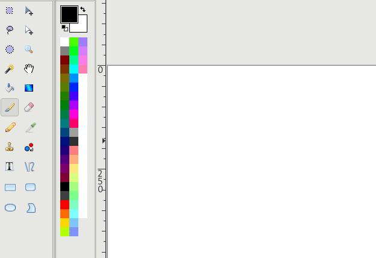

# Documentation of Tableaunoir

## Philosophy of Tableaunoir: KISS

The main philosophy is KISS (keep it simple, stupid). That is why many usual features are not (and will not be) implemented in Tableaunoir. 

### No line thickness or style option

In Tableaunoir, you cannot change the line width (thickness) and the type of stroke. It is because this features are not very useful. Also, just do as if you use a pen on a paper, or a chalk on a real blackboard. 

  
So to keep the user interface simple, it will probably never be implemented. Tableaunoir is *not* a drawing software, but a board to teach/share ideas.

### No Zoom

Tableaunoir does not allow you to zoom in/out. It has many advantages:
- you focus on ideas instead of controlling the zoom
- it is more easy to know where other participants are
- all participants work at the *same* zoom level so you do not waste time and energy in finding at which zoom levels the other are
- it is confortable to know that you are *always* in the standard zoom level

### A unique mode for drawing and selecting

In usual image editor, there is a mode/tool for drawing and a mode for selecting. You may draw some shape, or you may draw some shape for selecting a zone. For an image editor, it is important since you do not to deteriorate your image when selecting! Here is how in work in -- let say -- the image editor Pinta:

Tableaunoir is a tool for teaching. Selection mode and drawing mode are the same. Why? Because when you teach you may draw quickly a circle around some term around an equation, so the students see the important term. Then you may think "oh I actually want to copy that". Now suppose you want to copy that term. While you will stuck in a usual image editor (or you have to undo, and redraw the shape again in the selection mode), here, just press Ctrl+C! It is not suitable for fine-grained image editor, but for teaching that is just simple!

### Scrolling

In Tableaunoir, you cannot scroll vertically and only horizontally. Some users may expect to have an infinite canvas in all directions. We think it is not a good idea because your board may lack of structure. Scrolling horizontally is just perfect because it allows you to have several panels in your board.

### Several fonts

You can change the font of texts etc. The user interface will remain simple to use.

### Magnet resizing

You cannot resize magnets (pictures) with the mouse. The reason is because we think magnets should be very easy to be moved. Displaying handles so that objects can be resized etc. will take space on the screen, will annoy the user when magnets are moved etc.

## Advanced features

Although it follows KISS, there are some advanced features. This repository contains some documentation and illustration in Tableaunoir.
- [How to make a presentation and/or replay your course with Tableaunoir](replay.md)
- [How to write scripts to custom Tableaunoir](scripts.md)

