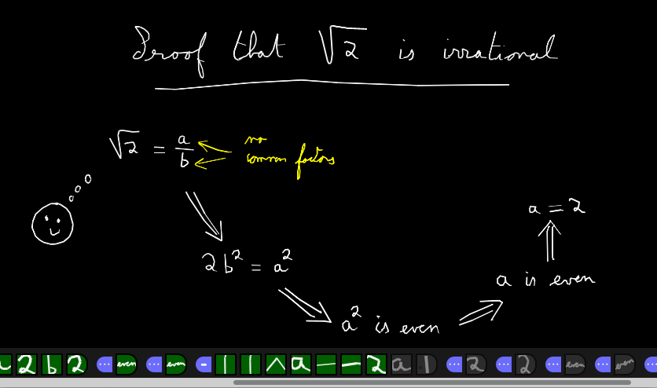

# Replay

Tableaunoir stores your course but also its evolution. If you want all the states of your blackboard, click on the animation/replay button in the toolbar:

## Navigation in your course

Each little square at the bottom represents an atomic action (a drawing, erasing something, etc.). When you click on, you will reach the state of the board after that action. The first square on the left is the initial state of the board.

## Editing

- Inserting new actions. Click on a square to reach the interested state you want to start with. Then just perform the action as usual (drawing, erasing).

- Delete an action. Drag and drop a square on the top to remove that action from the list. /!\ It can not be canceled!

- Change the order of actions. Drag and drop a square in another place to change the order. Soon, we will be able to move several actions.

