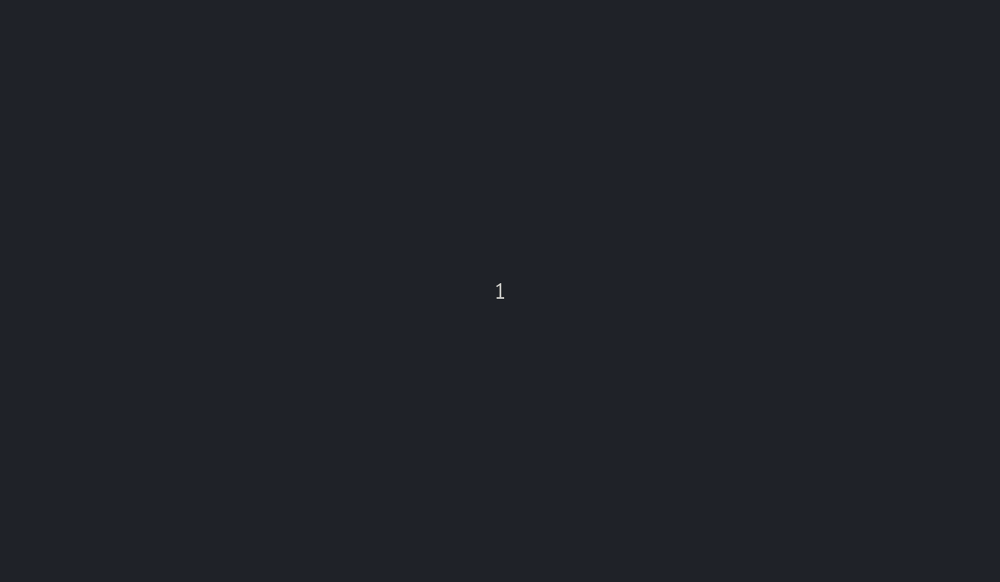
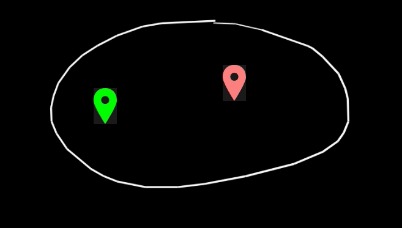

# Scripts

In Tableaunoir, you can use scripts to boost your creativity! You can write any Javascript code + function from [https://github.com/tableaunoir/tableaunoir/blob/master/src/Script.ts]. But let us discuss some examples.


## Tableaunoir sings!

This example illustrates how to add music when drawing. See [https://www.youtube.com/watch?v=IXy4FrHXFCo].

```javascript
let o = S.newOscillator()
let b = false;

S.onupdate = () => {
    if (ismousedown) {
        if (!b) {
            o = S.newOscillator()
            o.start();
            b = true;
        }
        S.setFrequency(o, musicScoreYToFrequency(point.y));
    }
    else {
        if (b) {
            o.stop()
            b = false;
        }
    }
}
```

## Seesaw

This example illustrates how to move magnets automatically to have an animation.


```javascript
A.addEventListener("pointermove", 
     () => {S.magnetMove(B, S.center(B).x, 1000-S.center(A).y);
            S.magnetMove(A, 300, S.center(A).y); })
```

## Scratching

You may scratch a zone and discover the set of points in the plane that satisfy some conditions. In the example, a convex polygon (in green).


```javascript
  S.onmousemove = ({ x, y }) => {
      x = S.round1(7 * (x - 239) / (880 - 239));
      y = S.round1(-7 * (y - 820) / (820 - 239));
      const a = S.round1(5 * x - 2 * y);
      const b = S.round1(7 - x - y);
      const c = S.round1(5 - x);
      S.magnetSetText(m112801, `x=${x} </br> y=${y}   </br> a=${a}  </br>   b=${b}   </br>  c=${c}`);
      S.setColor((a >= 0 && b >= 0 && c >= 0 && x >= 0 && y >= 0) ? "#008822" : "#220000");
 }
```
     
     
    
## Car game

Make a car game in Tableaunoir in 30sec. Draw a map, draw a car, transform the car in magnet and load the script below!



```javascript
let angle = 0;
let speed = 0;
let c = {x: 200, y: 200};
let car = S.getMagnets()[0];

function control() {
    if(keys["a"]) angle-=0.05;
    if(keys["e"]) angle+=0.05;
    if(keys["z"]) speed += 0.5;
    speed = Math.min(10.0, speed);
    car.style.transform = `rotate(${angle}rad)`;
};

S.onupdate = () => {
    control();
    speed -= 0.2;
    speed = Math.max(0.0, speed);
    const nc = {x: c.x, y: c.y};
    nc.x += speed * Math.cos(angle);
    nc.y += speed * Math.sin(angle);
    nc.x = Math.max(0.0, nc.x);
    nc.y = Math.max(0.0, nc.y);
    nc.x = Math.min(2000.0, nc.x);
    nc.y = Math.min(1000.0, nc.y);

    if(!S.magnetDrawingUnder(car, nc.x, nc.y))
        c = nc;
    S.magnetMove(car, c.x, c.y);
}
```


## A* algorithm



```javascript
const dist = (a, b) => Math.sqrt((a.x - b.x) ** 2 + (a.y - b.y) ** 2);

const factor = 0;


class Astar {
    G; start; target; d; visited; treated; queue; pred; h;
    constructor(G, start, target) {
        this.G = G;
        this.start = start;
        this.target = target;
        this.queue = new MinHeap();
        this.queue.insert(start, 0);

        this.d = {};
        this.pred = {};
        this.visited = {};
        this.treated = {};
        this.visited[start.x + "_" + start.y] = start;
        this.d[start.x + "_" + start.y] = 0;
        this.h = (node) => factor * dist(node, target);
    }

    drawPathEndingIn(node) {
        if (node) {
            S.setPixel(node, "rgba(255, 255, 0, 1)");
            this.drawPathEndingIn(this.pred[node.x + "_" + node.y])
        }
    }


    update() {
        if (this.queue.isEmpty())
            return;

        const node = this.queue.remove();
        if (node != undefined) {
            this.treated[node.x + "_" + node.y] = node;
            this.visited[node.x + "_" + node.y] = node;
            if (node.x == this.target.x && node.y == this.target.y) {
                this.queue = new MinHeap();
                this.drawPathEndingIn(this.target);
                console.log("win")
                return;
            }
            S.setPixel(node, "rgba(0, 0, 255, 1)");

            for (const { node: n, weight: w } of this.G.getEdgesToNeighbors(node)) {
                if (this.d[n.x + "_" + n.y] == undefined || (this.d[n.x + "_" + n.y] > this.d[node.x + "_" + node.y] + w)) {
                    this.d[n.x + "_" + n.y] = this.d[node.x + "_" + node.y] + w;
                    S.setPixel(n, "rgba(255, 0, 0, 1)");
                    this.visited[n.x + "_" + n.y] = n;
                    this.pred[n.x + "_" + n.y] = node;
                    this.queue.insert(n, this.d[n.x + "_" + n.y] + this.h(n));
                }
            }
        }
        return node;
    }

    clean() {
        for (let key in this.visited)
            S.clearPixel(this.visited[key]);
    }
}


class BidirectionalAstar {
    algoST; algoTS;
    finished;

    constructor(G, start, target) {
        this.algoST = new Astar(G, start, target);
        this.algoTS = new Astar(G, target, start);
        this.finished = false;
    }

    update() {
        if (this.finished)
            return;

        function appearsIn(node, D) {
            if (D[node.x + "_" + node.y])
                return true;
            return false;
        }

        const x = this.algoST.update();
        const y = this.algoTS.update();

        if (x == undefined) {
            this.finished = true;
            return;
        }
        if (y == undefined) {
            this.finished = true;
            return;
        }
        
        if (appearsIn(x, this.algoTS.treated) || appearsIn(y, this.algoST.treated)) {
            console.log("win");
            this.finished = true;
        }
    }

    clean() {
        this.algoST.clean();
        this.algoTS.clean();
    }

}

const G = new PixelGraph();
let algo;

S.nbUpdatePerCycle = 100;

reset();

function reset() {
    if (algo != undefined)
        algo.clean();

    const start = S.magnetMiddleBottom(S.getMagnets()[0]);
    const target = S.magnetMiddleBottom(S.getMagnets()[1]);
    algo = new Astar(G, start, target);
    //algo = new BidirectionalAstar(G, start, target);
}

S.onupdate = () => algo.update();
S.onmagnetmove = reset;
```


## More scripts?

You can open a pull-request and suggest one of your script!
