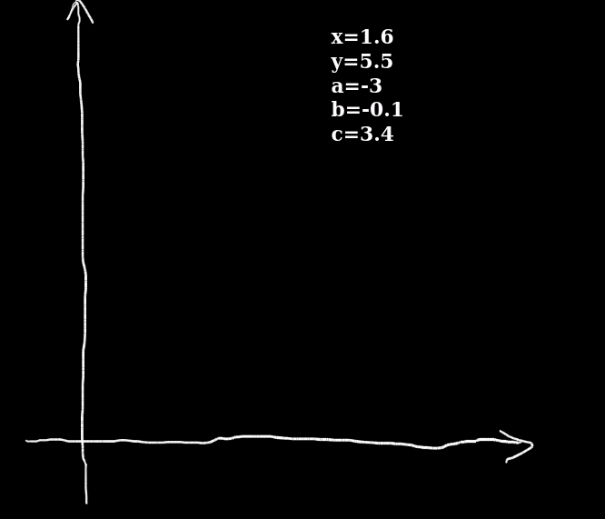

# Scripts

In Tableaunoir, you can use scripts to boost your creativity! You can write any Javascript code + function from [https://github.com/tableaunoir/tableaunoir/blob/master/src/Script.ts]. But let us discuss some examples.

## Seesaw

This example illustrates how to move magnets automatically to have an animation.

    A.addEventListener("pointermove", 
         () => {S.magnetMove(B, S.center(B).x, 1000-S.center(A).y);
                S.magnetMove(A, 300, S.center(A).y); })

## Scratching

You may scratch a zone and discover the set of points in the plane that satisfy some conditions. In the example, a convex polygon (in green).

      S.mousemove = ({ x, y }) => {
          x = S.round1(7 * (x - 239) / (880 - 239));
          y = S.round1(-7 * (y - 820) / (820 - 239));
          const a = S.round1(5 * x - 2 * y);
          const b = S.round1(7 - x - y);
          const c = S.round1(5 - x);
          S.magnetSetText(m112801, `x=${x}   y=${y}     a=${a}      b=${b}      c=${c}`);
          S.setColor((a >= 0 && b >= 0 && c >= 0 && x >= 0 && y >= 0) ? "#008822" : "#220000");
     }

