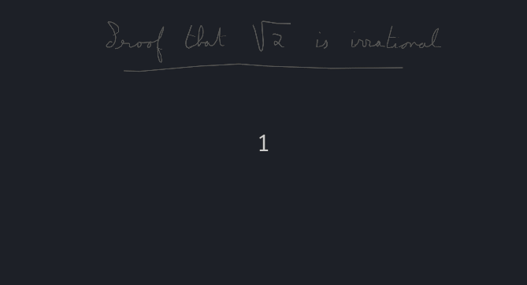

# Make a presentation / animation

With Tableaunoir, you can create animated course / presentation. You can then:
- make presentations (by pressing PageDown and PageUp you will move in your slides)
- make animated GIFs (together with the software Peek for instance)
- make videos (together with the software OBS)

## Example of an animated proof

Here is an example of a GIF:

Please also find an example of video: [https://www.youtube.com/watch?v=SsBujkaOnr4]

## Animation mode!

Tableaunoir stores your course but also its evolution in the timeline. If you want all the states of your blackboard, click on the animation/replay button in the toolbar:

## Navigation in your course

The timeline is displayed a the bottom of the screen. The progress bar is similar to the one of a Youtube video: the past is represented in red; while the future is in grey.

There are three buttons. The left and right arrows are for navigating in the presentation (last and next slides). The third button (hearts) proposes a menu to add new slides and to merge slides. Below the progress bar, each little square represents an atomic action. An atomic action can be: a drawing, erasing something, erasing the full board, adding a magnet, deleting a magnet, moving a magnet, etc. When you click on, you will reach the state of the board after that action. The first empty square (on the left) is the beginning of the slide.

## Editing

- Inserting new actions. Click on a square to reach the interested state you want to start with. Then just perform the action as usual (drawing, erasing).
- Delete an action. Drag and drop a square on the top to remove that action from the list.
- Change the order of actions. Drag and drop a square in another place to change the order.
- To perform deletion/change the order of actions and slides, use Ctrl for selecting several actions and/or slides, and Shift for consecutive selections.
- Make a keyframe (equivalent of `\pause` in LaTEX beamer), go in the heart menu and select `new slide from here`.
- for adding a new slide clicking by clearing all the board, go in the tool menu (pressing "t") and choose "Clear the board" (the icon is an eraser with a cape).

## For running your animation

Press Page Down and Page Up to see your course/animation.
